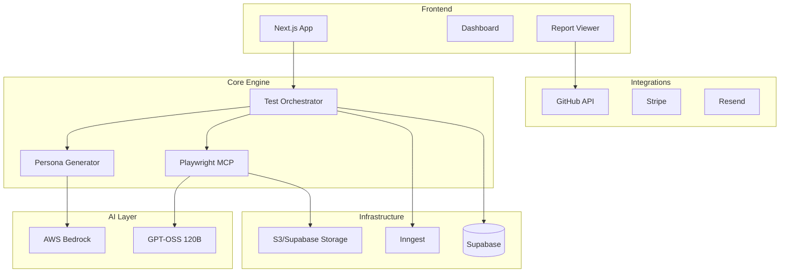

# DevConsul Technical Roadmap

## \ud83d\udcdd Overview

This document outlines the technical implementation roadmap for transforming the current Next.js template into DevConsul, an AI-powered customer feedback simulation platform.

## \ud83c\udfc1 Current State

- **Base Template**: Next.js + Supabase + Clerk + Inngest + PostHog + Resend + Stripe
- **Repository**: [Ch0daboy/ezstack](https://github.com/Ch0daboy/ezstack)
- **Status**: Template cloned, blueprint issues created

## \ud83c\udfaf Target Architecture



## \ud83d\udee0\ufe0f Implementation Phases

### Phase 1: Foundation (2 weeks)

#### 1.1 Project Setup
- [ ] Rename project to DevConsul
- [ ] Update branding and metadata
- [ ] Configure environment for new services
- [ ] Set up development workflow

#### 1.2 Database Schema
```sql
-- Core tables
CREATE TABLE projects (
    id UUID PRIMARY KEY,
    user_id TEXT REFERENCES users(clerk_id),
    name TEXT NOT NULL,
    url TEXT NOT NULL,
    settings JSONB,
    created_at TIMESTAMPTZ DEFAULT NOW()
);

CREATE TABLE personas (
    id UUID PRIMARY KEY,
    project_id UUID REFERENCES projects(id),
    name TEXT NOT NULL,
    attributes JSONB, -- demographics, tech level, goals
    prompt_template TEXT,
    created_at TIMESTAMPTZ DEFAULT NOW()
);

CREATE TABLE test_sessions (
    id UUID PRIMARY KEY,
    project_id UUID REFERENCES projects(id),
    persona_id UUID REFERENCES personas(id),
    status TEXT, -- pending, running, completed, failed
    started_at TIMESTAMPTZ,
    completed_at TIMESTAMPTZ,
    metadata JSONB
);

CREATE TABLE test_interactions (
    id UUID PRIMARY KEY,
    session_id UUID REFERENCES test_sessions(id),
    timestamp TIMESTAMPTZ,
    action_type TEXT, -- click, type, navigate, etc.
    element_selector TEXT,
    value TEXT,
    screenshot_url TEXT,
    ai_reasoning TEXT
);

CREATE TABLE reports (
    id UUID PRIMARY KEY,
    session_id UUID REFERENCES test_sessions(id),
    findings JSONB,
    summary TEXT,
    created_at TIMESTAMPTZ DEFAULT NOW()
);
```

#### 1.3 AWS Bedrock Integration
```typescript
// lib/ai/bedrock.ts
import { BedrockRuntimeClient, InvokeModelCommand } from "@aws-sdk/client-bedrock-runtime";

export class PersonaGenerator {
    private client: BedrockRuntimeClient;
    
    async analyzeWebsite(url: string): Promise<WebsiteAnalysis> {
        // Fetch and analyze website content
        // Extract purpose, target audience, features
    }
    
    async generatePersona(analysis: WebsiteAnalysis): Promise<Persona> {
        // Use Bedrock to generate diverse personas
        // Include demographics, goals, tech proficiency
    }
}
```

### Phase 2: Core Features (3 weeks)

#### 2.1 Playwright MCP Integration
```typescript
// lib/browser/playwright-mcp.ts
export class BrowserAutomation {
    private mcpClient: MCPClient;
    
    async startSession(url: string): Promise<Session> {
        // Initialize Playwright via MCP
        // Set up recording and screenshots
    }
    
    async navigate(instruction: string): Promise<void> {
        // Use AI to determine navigation action
        // Execute via MCP protocol
    }
}
```

#### 2.2 Test Orchestrator
```typescript
// lib/testing/orchestrator.ts
export class TestOrchestrator {
    async runTest(projectId: string, personaId: string): Promise<TestSession> {
        // 1. Load persona and project details
        // 2. Initialize browser session
        // 3. Execute AI-driven navigation
        // 4. Record interactions and findings
        // 5. Generate report
    }
}
```

#### 2.3 AI Decision Engine
```typescript
// lib/ai/decision-engine.ts
export class DecisionEngine {
    async getNextAction(
        persona: Persona,
        currentState: PageState,
        goal: string
    ): Promise<Action> {
        // Use GPT-OSS 120B to determine next action
        // Consider persona characteristics
        // Return specific browser action
    }
}
```

### Phase 3: MVP Features (2 weeks)

#### 3.1 GitHub Integration
- OAuth flow implementation
- Repository selection UI
- Issue template system
- Webhook receivers for PR triggers

#### 3.2 Scheduling System
```typescript
// lib/scheduling/scheduler.ts
export const scheduleTest = inngest.createFunction(
    { id: "schedule-test", name: "Scheduled Test Run" },
    { cron: "0 */6 * * *" }, // Every 6 hours
    async ({ event, step }) => {
        // Trigger test for scheduled projects
    }
);
```

#### 3.3 Advanced Reporting
- Implement comparison logic
- Create visualization components
- Add export functionality (PDF/JSON)
- Build report sharing system

### Phase 4: Beta (2 weeks)

#### 4.1 Performance Optimization
- Implement caching strategies
- Optimize database queries
- Add CDN for static assets
- Implement rate limiting

#### 4.2 Billing Implementation
```typescript
// lib/billing/usage.ts
export class UsageTracker {
    async trackTestSession(userId: string, sessionId: string) {
        // Track usage against plan limits
        // Trigger billing events if needed
    }
}
```

### Phase 5: Launch (1 week)

#### 5.1 Public API
```typescript
// app/api/v1/tests/route.ts
export async function POST(req: Request) {
    // Validate API key
    // Create test session
    // Return session ID for polling
}
```

#### 5.2 Documentation & Marketing
- API documentation
- User guides
- Video tutorials
- Landing page
- ProductHunt preparation

## \ud83d\udcca Success Metrics

### Technical Metrics
- Test execution time < 5 minutes
- Persona generation < 5 seconds
- 99.9% uptime
- Support for 100+ concurrent sessions

### Business Metrics
- 100 beta users by end of Phase 4
- 500 signups within first month
- 10% conversion to paid plans
- NPS score > 50

## \ud83d\udeab Risks & Mitigations

| Risk | Impact | Mitigation |
|------|--------|------------|
| AI costs too high | High | Implement caching, optimize prompts |
| Browser automation unreliable | High | Fallback strategies, retry logic |
| Slow test execution | Medium | Parallel processing, queue optimization |
| GitHub API rate limits | Medium | Implement proper rate limiting |
| Complex websites break automation | Medium | Graceful degradation, error reporting |

## \ud83d\udcda Dependencies

### External Services
- AWS Bedrock API availability
- Playwright MCP server stability
- GitHub API
- Stripe payment processing

### Technical Dependencies
- Next.js 15 stable release
- Supabase real-time features
- Inngest queue reliability

## \ud83d\udd04 Future Enhancements (Post-Launch)

1. **Mobile Testing**: Add mobile browser simulation
2. **API Testing**: Extend beyond web UI to API testing
3. **Custom Assertions**: Let users define specific test criteria
4. **Team Collaboration**: Multi-user projects and shared reports
5. **CI/CD Integrations**: Jenkins, CircleCI, GitLab CI
6. **Accessibility Scoring**: WCAG compliance scoring
7. **Performance Monitoring**: Lighthouse integration
8. **A/B Test Analysis**: Compare different versions
9. **Slack/Discord Integration**: Real-time notifications
10. **White-label Solution**: Enterprise customization

## \ud83d\udce6 Migration Strategy

### From Template to DevConsul

1. **Week 1**: Database schema migration
2. **Week 2**: Add AI services integration
3. **Week 3-4**: Build core testing engine
4. **Week 5-6**: Implement UI and reporting
5. **Week 7**: GitHub integration
6. **Week 8**: Beta testing and fixes
7. **Week 9**: Launch preparation

## \ud83d\udc65 Team Requirements

### Recommended Team
- 1 Full-stack Developer (Lead)
- 1 AI/ML Engineer (part-time)
- 1 UI/UX Designer (part-time)
- 1 DevOps Engineer (part-time)

### Solo Developer Timeline
- Add 50% to all phase estimates
- Focus on MVP features first
- Consider outsourcing UI design

## \ud83d\udcde Support & Monitoring

### Monitoring Stack
- Vercel Analytics (performance)
- PostHog (user behavior)
- Sentry (error tracking)
- AWS CloudWatch (AI usage)

### Support Channels
- GitHub Issues
- Discord community
- Email support (paid plans)
- Documentation site

---

*Last Updated: January 2025*
*Version: 1.0.0*
